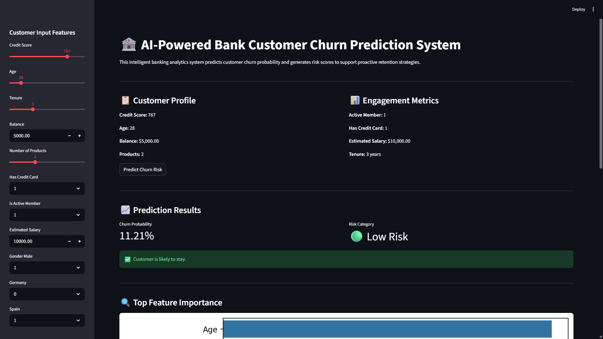
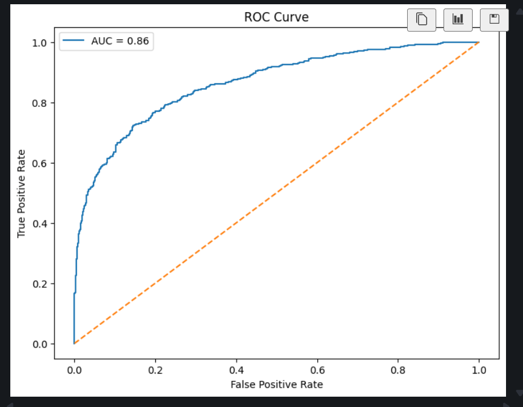
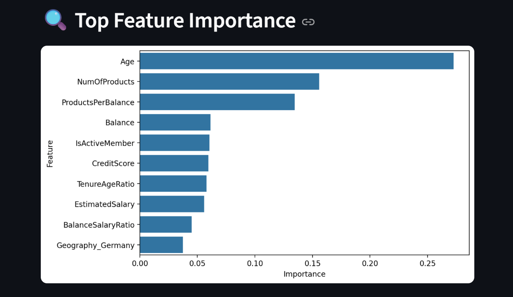
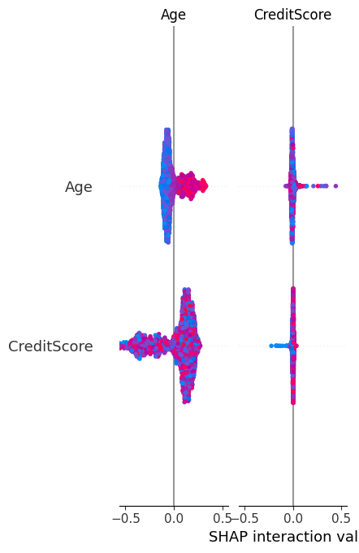

# 🏦 AI-Powered Bank Customer Churn Prediction System

## 📌 Project Overview

This project develops an intelligent machine learning–based customer churn prediction and risk scoring system for the banking sector.

The system predicts whether a customer is likely to leave the bank and generates probability-based churn risk scores to support proactive customer retention strategies.

---

## 🎯 Objectives

### Primary Objectives
- Predict customer churn with high accuracy
- Generate churn probability scores
- Identify major churn drivers

### Secondary Objectives
- Improve customer retention strategies
- Reduce false-positive churn predictions
- Build explainable AI solutions for banking analytics

---

## 📊 Dataset Features

The dataset includes customer information such as:

- Credit Score
- Geography
- Gender
- Age
- Tenure
- Account Balance
- Number of Products
- Credit Card Status
- Active Membership
- Estimated Salary

### Target Variable
- `Exited`
  - 1 → Customer churned
  - 0 → Customer retained

---

## ⚙️ Technologies Used

- Python
- Pandas
- NumPy
- Scikit-learn
- Matplotlib
- Seaborn
- SHAP
- Streamlit
- Joblib

---

## 📂 Dataset Information

The dataset used in this project contains customer demographic, financial, and engagement-related information for churn prediction analysis.

Dataset Link:  
https://drive.google.com/file/d/1TpMEWG4De0sD_P7_VJ7HtjT_89jlJHpQ/view

---

## 🧠 Machine Learning Models

### Baseline Model
- Logistic Regression

### Advanced Model
- Random Forest Classifier

---

## 📈 Features Implemented

### Data Preprocessing
- Missing value handling
- Feature encoding
- Feature scaling

### Feature Engineering
- Balance-to-Salary Ratio
- Tenure-Age Ratio
- Products-per-Balance Ratio

### Model Evaluation
- Accuracy
- Precision
- Recall
- F1-Score
- ROC-AUC Score
- Confusion Matrix

### Explainable AI
- Feature Importance Analysis
- SHAP Explainability

### Risk Scoring System
- Low Risk
- Medium Risk
- High Risk

---

## 📊 Exploratory Data Analysis

Key analyses performed:
- Customer churn distribution
- Age distribution by churn
- Balance vs churn
- Active membership analysis
- Correlation heatmap

---

## 🌐 Streamlit Dashboard

### Dashboard Preview

#### Main Dashboard


#### Roc Curve


#### Feature Importance


#### SHAP Explainability

---

## 🚀 Live Streamlit Deployment

Live AI Dashboard:  
https://bank-customer-churn-prediction-zehbhebulm3jrxfhnstjvy.streamlit.app/


## 📂 Project Structure

```bash
Bank_Customer_Churn_Project
│
├── models
├── notebooks
├── streamlit_app
├── reports
├── outputs
├── requirements.txt
└── README.md
```

---

## 🚀 Run the Project

### Clone Repository

```bash
git clone https://github.com/YOUR_USERNAME/bank-customer-churn-prediction.git
```

### Install Dependencies

```bash
pip install -r requirements.txt
```

### Run Streamlit App

```bash
cd streamlit_app

python -m streamlit run app.py
```

---

## 📌 Project Outcomes

- Developed a machine learning churn prediction system
- Generated explainable churn risk scores
- Built an interactive Streamlit dashboard
- Enabled proactive customer retention insights

---

## 👨‍💻 Author

Neelam Raghu Babu

- LinkedIn: https://www.linkedin.com/in/raghu-babu-654b96324/
- GitHub: https://github.com/raghu-3113
